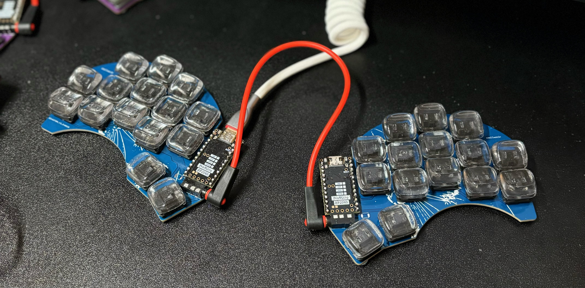
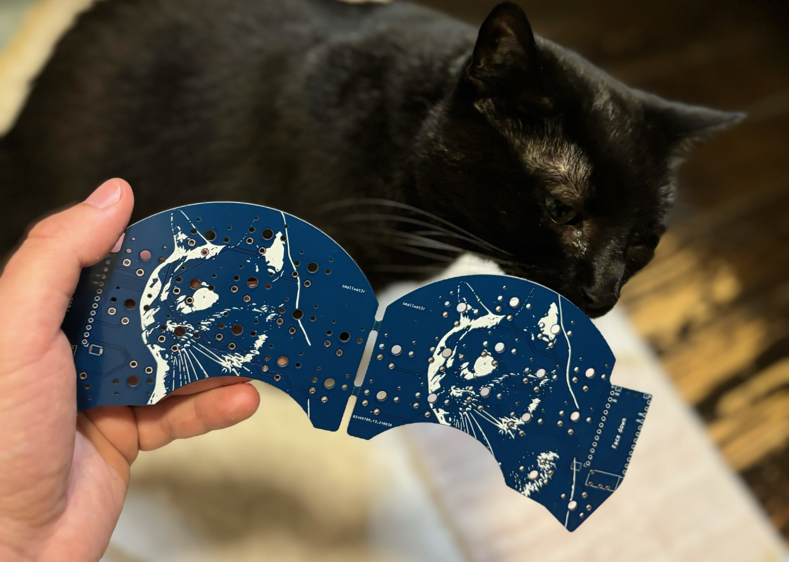
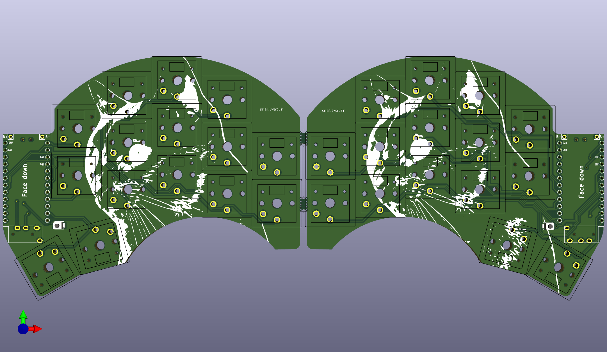
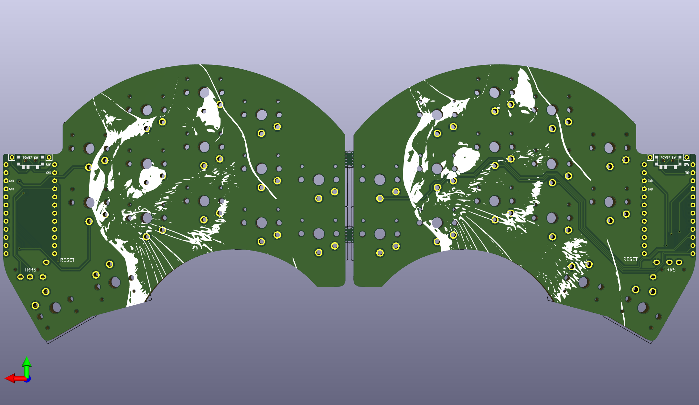
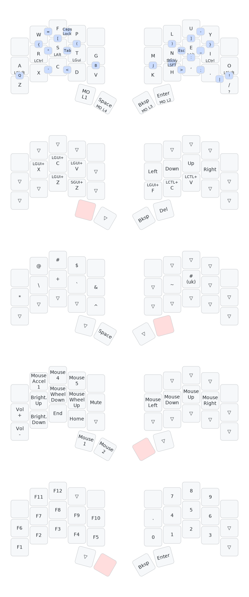

# Sweep Cat

A 30 keys version of the fantastic [Sweep 2.2](https://github.com/davidphilipbarr/Sweep), featuring my cat, Lila.

This repository contains:
- Gerber file (comptatible with [JLCPCB](https://jlcpcb.com))
- Kicad file
- My Vial keymap file

## PCB

## Keymap

I highly rely on combos from the main layer.

