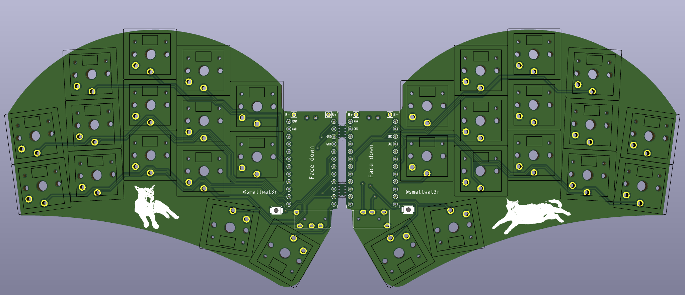
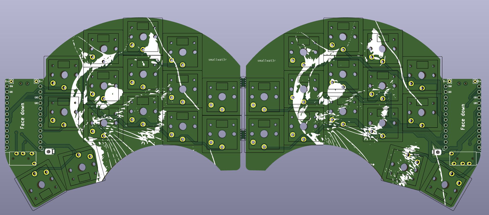

# Sweep Cat

A 30-key version of the fantastic [Sweep 2.2](https://github.com/davidphilipbarr/Sweep), featuring my cat, Lila.

## v2

This newer version adds some slight angle to the two outermost columns, which makes it more comfortable and natural to type on.

- Splay on pinkie finger: 8°
- Splay on ring finger: 3°

## v1

This is the original version of the Sweep Cat.

## Contents

This repository contains:
- Gerber files (comptatible with [JLCPCB](https://jlcpcb.com))
- Kicad files
- My Vial keymap file

## Keymap

